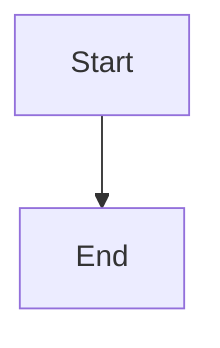

# orphan_sweeper.rs

Source File: `crates/factory-cli/src/operator/orphan_sweeper.rs`

## Component Architecture

```mermaid
classDiagram
    class OrphanSweeper
```

## Execution Flow

```mermaid
flowchart TD
    Start --> End
```
