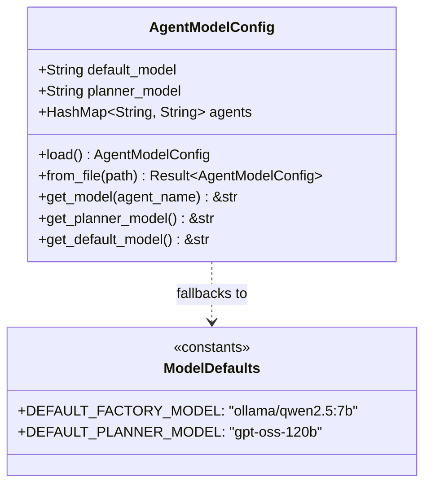

# factory-core::config — Factory Model Configuration

> **Source**: `crates/factory-core/src/config.rs`  
> **Layer**: Domain (innermost onion layer)  
> **Role**: Centralized configuration management for LLM model endpoints, agent-specific model bindings, and LiteLLM proxy resolution.

---

## Architecture & Class Diagram

## Configuration Resolution Hierarchy

1. **Environment Variables**:
   - `FACTORY_MODELS_CONFIG`: Path to custom YAML/JSON configuration.
   - `LITELLM_MODEL`: Overrides the default agent model.
   - `LITELLM_PLANNER_MODEL` / `PLANNER_MODEL`: Overrides the planner model.
2. **Configuration Files** (searched in order):
   - `config/models.yaml`, `config/models.yml`, `config/models.json`
   - `models.yaml`, `models.json`
   - `../config/models.yaml`, `../../config/models.yaml`
3. **Hardcoded Fallbacks**:
   - Default Factory Model: `ollama/qwen2.5:7b` (via LiteLLM proxy)
   - Default Planner Model: `gpt-oss-120b`

---

> *Related: [lib.rs](crates_factory-core_src_lib.md) · [Tactical Design](TACTICAL-DESIGN.md)*
