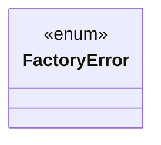
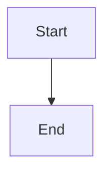

# error.rs

Source File: `crates/factory-core/src/error.rs`

## Component Architecture

```mermaid
classDiagram
    class FactoryError {
        <<enum>>
    }
```

## Execution Flow

```mermaid
flowchart TD
    Start --> End
```
