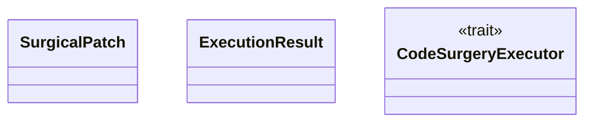
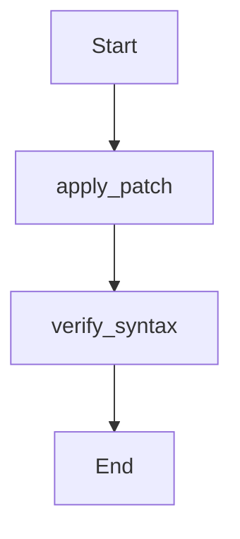

# executor.rs

Source File: `crates/factory-core/src/executor.rs`

## Component Architecture

```mermaid
classDiagram
    class SurgicalPatch
    class ExecutionResult
    class CodeSurgeryExecutor {
        <<trait>>
    }
```

## Execution Flow

```mermaid
flowchart TD
    Start --> apply_patch
    apply_patch --> verify_syntax
    verify_syntax --> End
```
