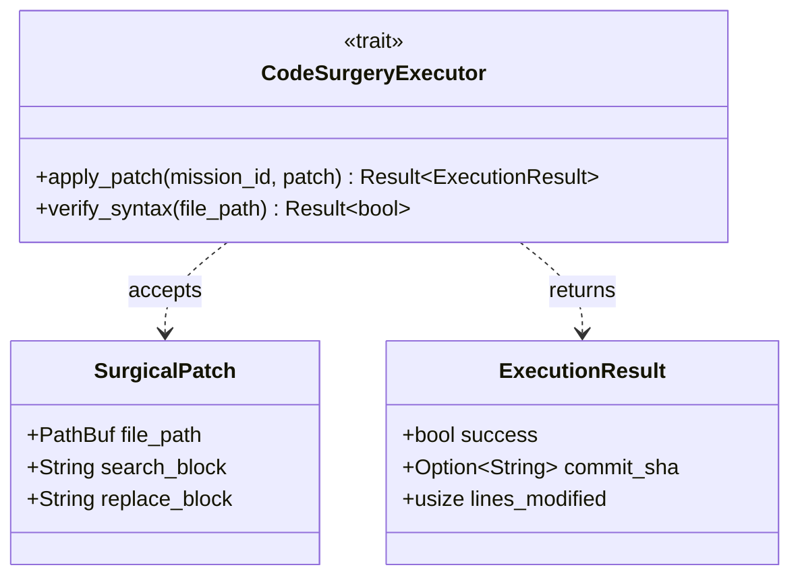
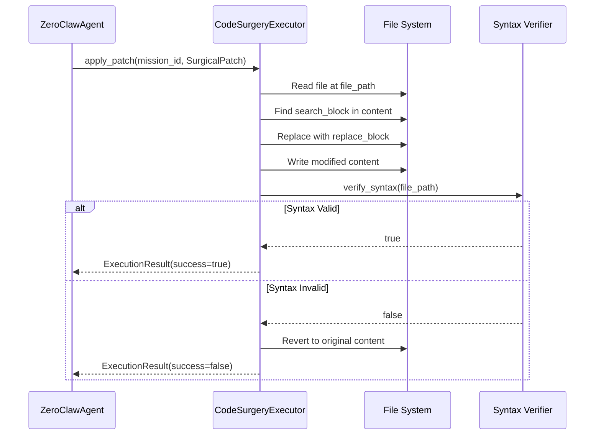

# factory-core::executor — Code Surgery Execution

> **Source**: `crates/factory-core/src/executor.rs`
> **Layer**: Domain

---

## UML Class Diagram

## Sequence: Task Dispatch Flow

---

> *Related: [lib.rs](crates_factory-core_src_lib.md) · [ZeroClawAgent](crates_factory-application_src_agents_zeroclaw.md)*
