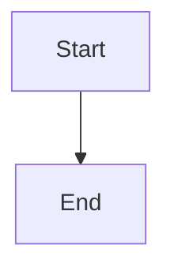

# lib.rs

Source File: `crates/factory-core/src/lib.rs`

## Component Architecture

```mermaid
classDiagram
    class Metadata
    class Inputs
    class Outputs
    class Targets
    class Mission
    class MissionStatus {
        <<enumeration>>
    }
    class Task
    class TaskStatus {
        <<enumeration>>
    }
    class SHAPValues
    class FeatureImportances
    class SpecArtifact
    class OsrMetric
    class FinOpsTag
    class ComplianceReport
    class UserFeedbackPayload
    class DailyBudgetConfig
    class SpendVelocityAlert
    class SentryCrashRecord
    class CausalProvenanceNode
    class PRDirective {
        <<enumeration>>
    }
    class PolledIssueEvent
    class PRCommentEvent
    class PollerSyncCursor
```

## Execution Flow

```mermaid
flowchart TD
    Start --> End
```
