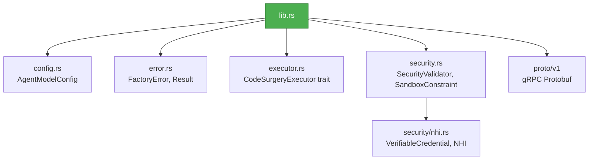
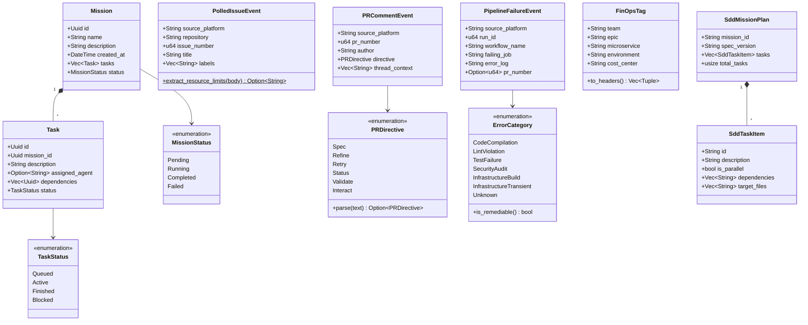

# factory-core — Crate Overview

> **Source**: `crates/factory-core/src/lib.rs`
> **Layer**: Domain (Onion Architecture — innermost layer)
> **Role**: Contains all domain entities, value objects, error types, security primitives, and protobuf definitions. Has zero dependencies on other factory crates.

---

## Module Tree

## Re-export Map

| Symbol | Source Module | Re-exported As |
|:---|:---|:---|
| `AgentModelConfig` | `config.rs` | `pub use config::AgentModelConfig` |

## Domain Entities (lib.rs)

## Dependencies

| Crate | Purpose |
|:---|:---|
| `serde` / `serde_json` | Serialization |
| `chrono` | Timestamps |
| `uuid` | Entity identifiers |
| `thiserror` | Error derivation |
| `ed25519-dalek` | Cryptographic signatures |
| `zeroize` | Memory wiping for secrets |
| `async-trait` | Async trait bounds |
| `prost` | Protobuf codegen |

---

> *Related: [error.rs](crates_factory-core_src_error.md) · [executor.rs](crates_factory-core_src_executor.md) · [security.rs](crates_factory-core_src_security.md)*
