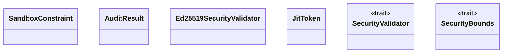
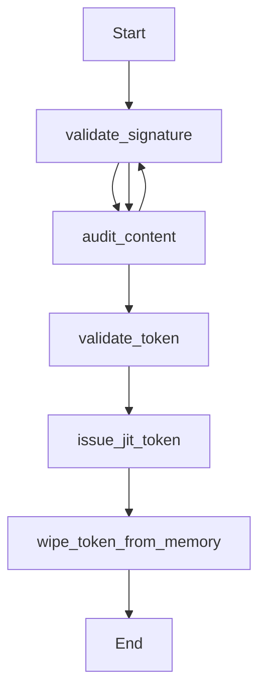

# security.rs

Source File: `crates/factory-core/src/security.rs`

## Component Architecture

```mermaid
classDiagram
    class SandboxConstraint
    class AuditResult
    class Ed25519SecurityValidator
    class JitToken
    class SecurityValidator {
        <<trait>>
    }
    class SecurityBounds {
        <<trait>>
    }
```

## Execution Flow

```mermaid
flowchart TD
    Start --> validate_signature
    validate_signature --> audit_content
    audit_content --> validate_signature
    validate_signature --> audit_content
    audit_content --> validate_token
    validate_token --> issue_jit_token
    issue_jit_token --> wipe_token_from_memory
    wipe_token_from_memory --> End
```
