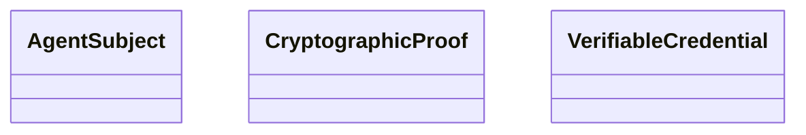
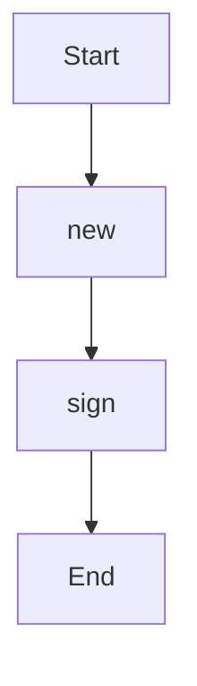

# nhi.rs

Source File: `crates/factory-core/src/security/nhi.rs`

## Component Architecture

```mermaid
classDiagram
    class AgentSubject
    class CryptographicProof
    class VerifiableCredential
```

## Execution Flow

```mermaid
flowchart TD
    Start --> new
    new --> sign
    sign --> End
```
