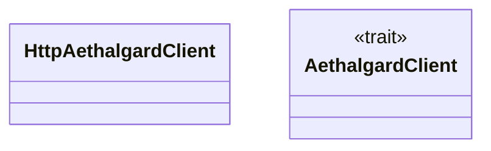
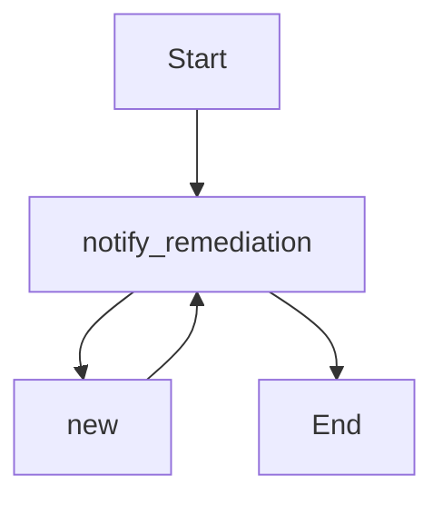

# aethalgard.rs

Source File: `crates/factory-infrastructure/src/aethalgard.rs`

## Component Architecture

```mermaid
classDiagram
    class HttpAethalgardClient
    class AethalgardClient {
        <<trait>>
    }
```

## Execution Flow

```mermaid
flowchart TD
    Start --> notify_remediation
    notify_remediation --> new
    new --> notify_remediation
    notify_remediation --> End
```
