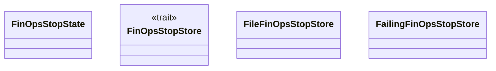
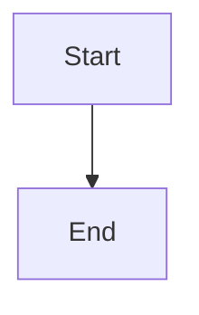

# finops_stop_store.rs

Source File: `crates/factory-infrastructure/src/finops_stop_store.rs`

## Component Architecture

```mermaid
classDiagram
    class FinOpsStopState
    class FinOpsStopStore {
        <<trait>>
    }
    class FileFinOpsStopStore
    class FailingFinOpsStopStore
```

## Execution Flow

```mermaid
flowchart TD
    Start --> End
```
