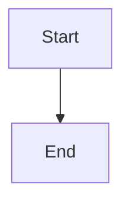

# github.rs

Source File: `crates/factory-infrastructure/src/github.rs`

## Component Architecture

```mermaid
classDiagram
    class GithubIssue
    class GithubPullRequest
    class GithubUser
    class GithubReaction
    class GithubComment
    class GithubWorkflowRun
    class GithubWorkflowJob
    class GithubWorkflowStep
    class GithubWorkflowRunsResponse
    class GithubWorkflowJobsResponse
    class GithubClient {
        <<trait>>
    }
    class HttpGithubClient
```

## Execution Flow

```mermaid
flowchart TD
    Start --> End
```
