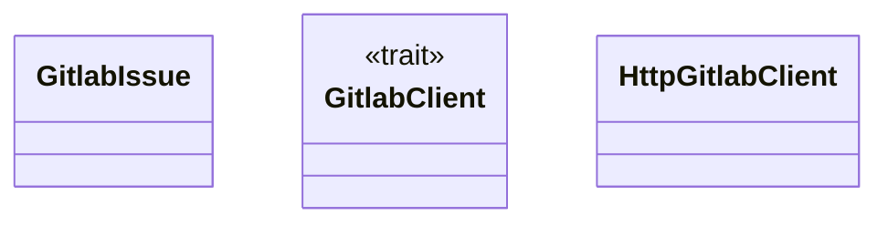
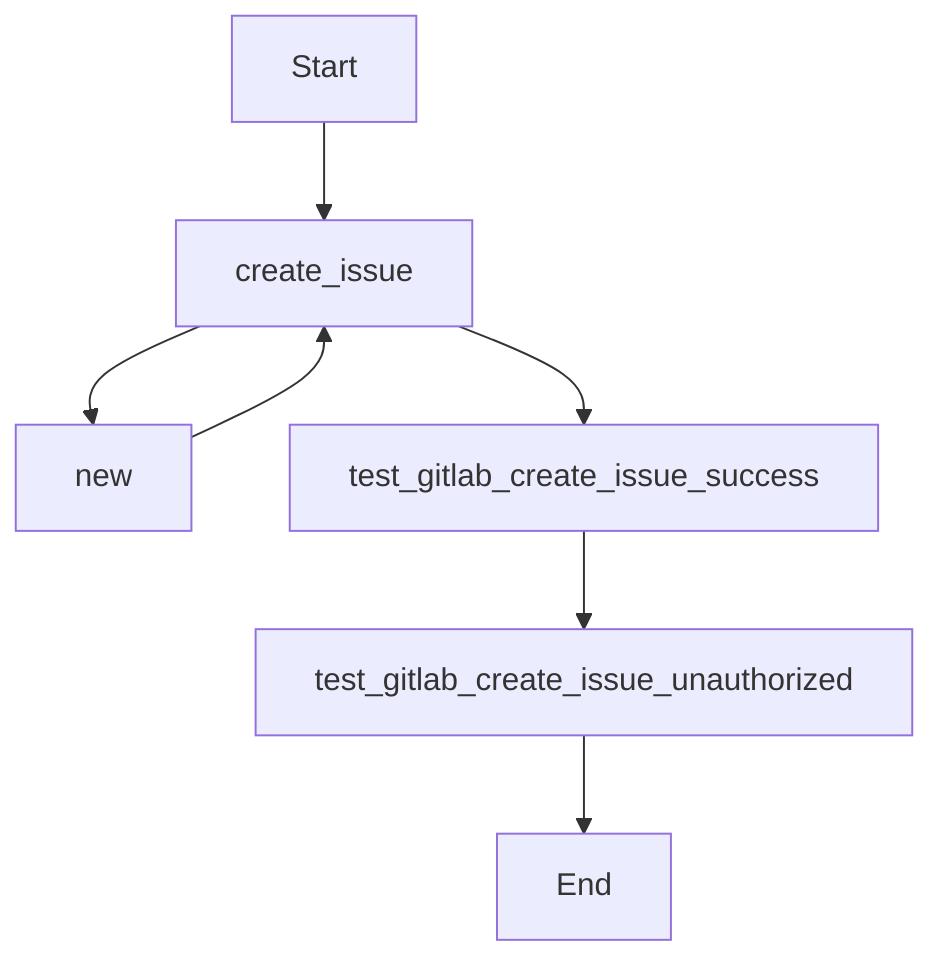

# gitlab.rs

Source File: `crates/factory-infrastructure/src/gitlab.rs`

## Component Architecture

```mermaid
classDiagram
    class GitlabIssue
    class GitlabClient {
        <<trait>>
    }
    class HttpGitlabClient
```

## Execution Flow

```mermaid
flowchart TD
    Start --> create_issue
    create_issue --> new
    new --> create_issue
    create_issue --> test_gitlab_create_issue_success
    test_gitlab_create_issue_success --> test_gitlab_create_issue_unauthorized
    test_gitlab_create_issue_unauthorized --> End
```
