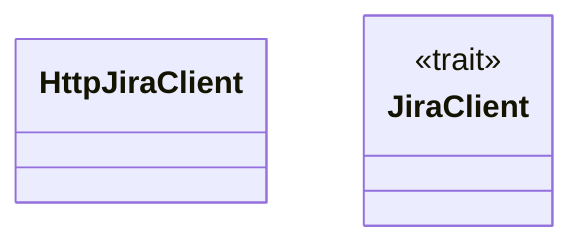
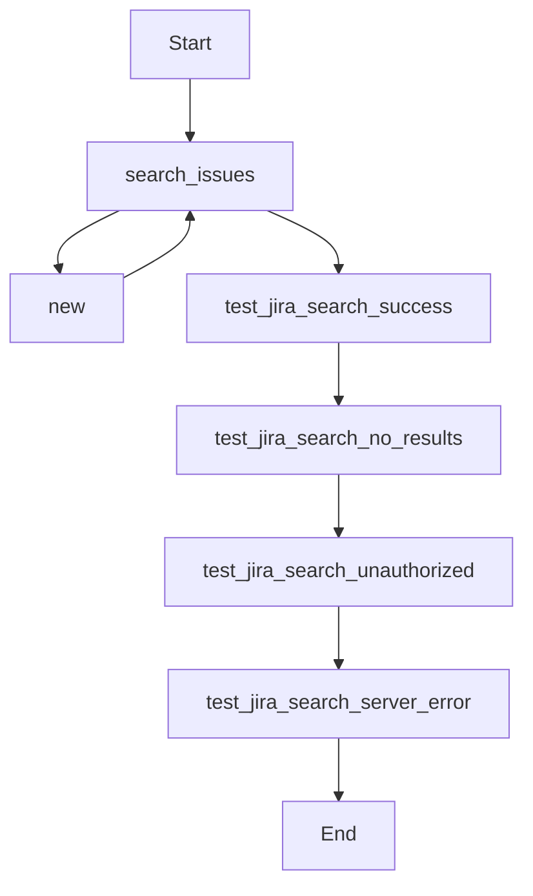

# jira.rs

Source File: `crates/factory-infrastructure/src/jira.rs`

## Component Architecture

```mermaid
classDiagram
    class HttpJiraClient
    class JiraClient {
        <<trait>>
    }
```

## Execution Flow

```mermaid
flowchart TD
    Start --> search_issues
    search_issues --> new
    new --> search_issues
    search_issues --> test_jira_search_success
    test_jira_search_success --> test_jira_search_no_results
    test_jira_search_no_results --> test_jira_search_unauthorized
    test_jira_search_unauthorized --> test_jira_search_server_error
    test_jira_search_server_error --> End
```
