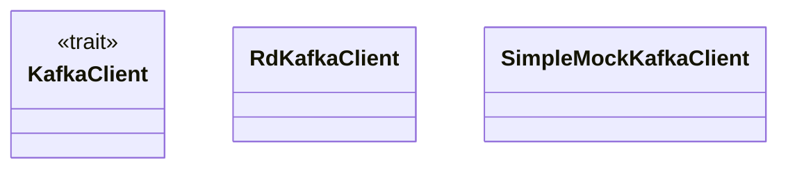
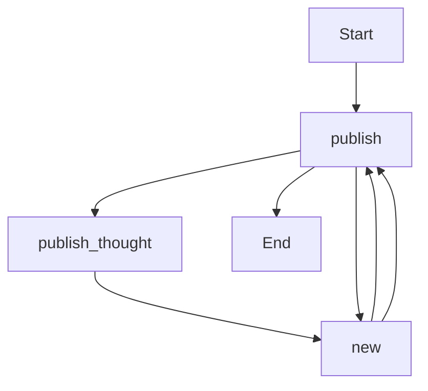

# kafka.rs

Source File: `crates/factory-infrastructure/src/kafka.rs`

## Component Architecture

```mermaid
classDiagram
    class KafkaClient {
        <<trait>>
    }
    class RdKafkaClient
    class SimpleMockKafkaClient
```

## Execution Flow

```mermaid
flowchart TD
    Start --> publish
    publish --> publish_thought
    publish_thought --> new
    new --> publish
    publish --> new
    new --> publish
    publish --> End
```
