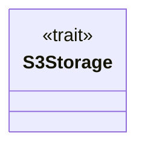
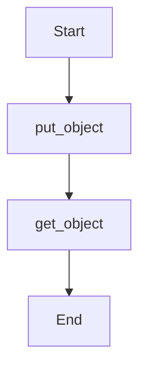

# lib.rs

Source File: `crates/factory-infrastructure/src/lib.rs`

## Component Architecture

```mermaid
classDiagram
    class S3Storage {
        <<trait>>
    }
```

## Execution Flow

```mermaid
flowchart TD
    Start --> put_object
    put_object --> get_object
    get_object --> End
```
