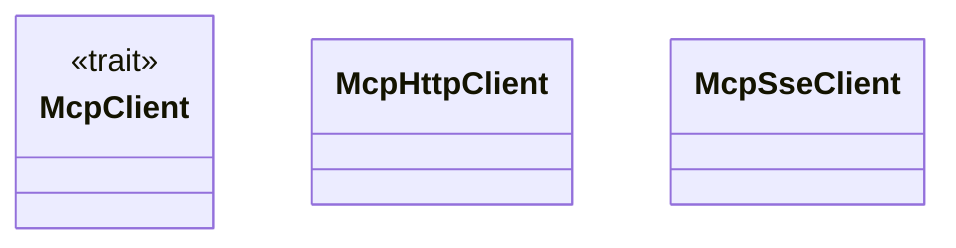
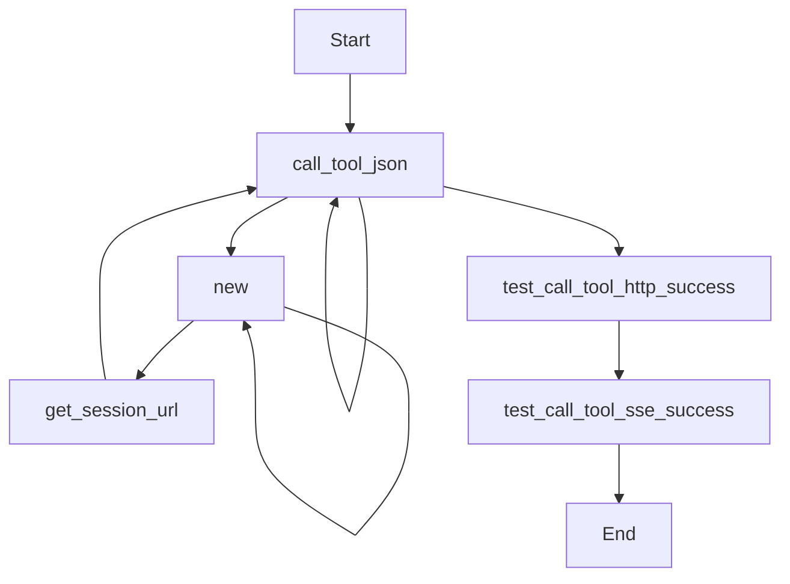

# mcp_client.rs

Source File: `crates/factory-infrastructure/src/mcp_client.rs`

## Component Architecture

```mermaid
classDiagram
    class McpClient {
        <<trait>>
    }
    class McpHttpClient
    class McpSseClient
```

## Execution Flow

```mermaid
flowchart TD
    Start --> call_tool_json
    call_tool_json --> call_tool_json
    call_tool_json --> new
    new --> new
    new --> get_session_url
    get_session_url --> call_tool_json
    call_tool_json --> test_call_tool_http_success
    test_call_tool_http_success --> test_call_tool_sse_success
    test_call_tool_sse_success --> End
```
