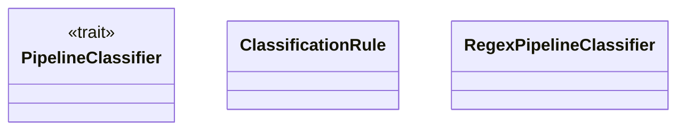
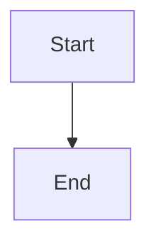

# pipeline_classifier.rs

Source File: `crates/factory-infrastructure/src/pipeline_classifier.rs`

## Component Architecture

```mermaid
classDiagram
    class PipelineClassifier {
        <<trait>>
    }
    class ClassificationRule
    class RegexPipelineClassifier
```

## Execution Flow

```mermaid
flowchart TD
    Start --> End
```
