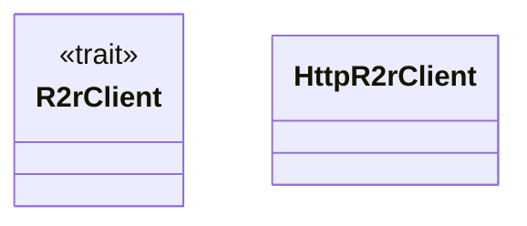
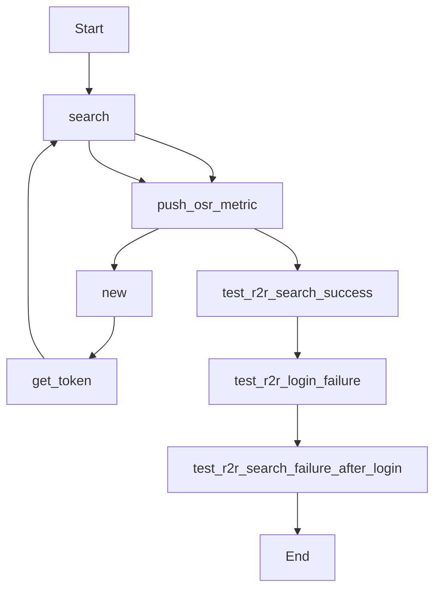

# r2r.rs

Source File: `crates/factory-infrastructure/src/r2r.rs`

## Component Architecture

```mermaid
classDiagram
    class R2rClient {
        <<trait>>
    }
    class HttpR2rClient
```

## Execution Flow

```mermaid
flowchart TD
    Start --> search
    search --> push_osr_metric
    push_osr_metric --> new
    new --> get_token
    get_token --> search
    search --> push_osr_metric
    push_osr_metric --> test_r2r_search_success
    test_r2r_search_success --> test_r2r_login_failure
    test_r2r_login_failure --> test_r2r_search_failure_after_login
    test_r2r_search_failure_after_login --> End
```
