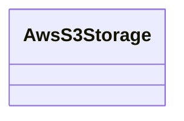
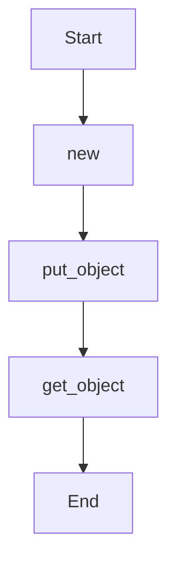

# s3.rs

Source File: `crates/factory-infrastructure/src/s3.rs`

## Component Architecture

```mermaid
classDiagram
    class AwsS3Storage
```

## Execution Flow

```mermaid
flowchart TD
    Start --> new
    new --> put_object
    put_object --> get_object
    get_object --> End
```
