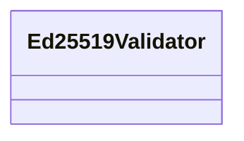
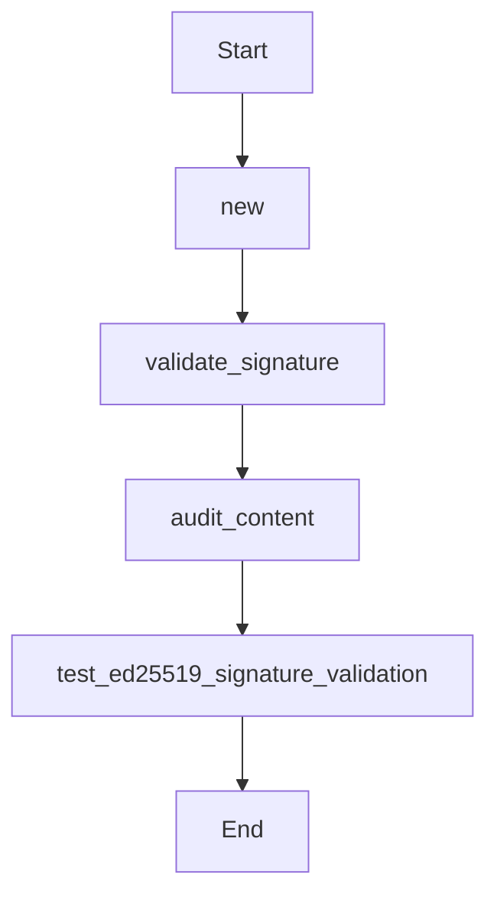

# security_validator.rs

Source File: `crates/factory-infrastructure/src/security_validator.rs`

## Component Architecture

```mermaid
classDiagram
    class Ed25519Validator
```

## Execution Flow

```mermaid
flowchart TD
    Start --> new
    new --> validate_signature
    validate_signature --> audit_content
    audit_content --> test_ed25519_signature_validation
    test_ed25519_signature_validation --> End
```
