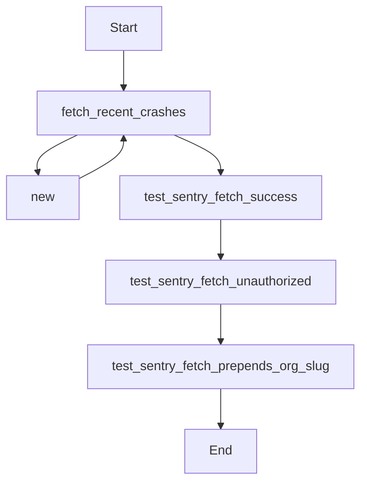

# sentry.rs

Source File: `crates/factory-infrastructure/src/sentry.rs`

## Component Architecture

```mermaid
classDiagram
    class CrashEvent
    class SentryClient {
        <<trait>>
    }
    class HttpSentryClient
```

## Execution Flow

```mermaid
flowchart TD
    Start --> fetch_recent_crashes
    fetch_recent_crashes --> new
    new --> fetch_recent_crashes
    fetch_recent_crashes --> test_sentry_fetch_success
    test_sentry_fetch_success --> test_sentry_fetch_unauthorized
    test_sentry_fetch_unauthorized --> test_sentry_fetch_prepends_org_slug
    test_sentry_fetch_prepends_org_slug --> End
```
