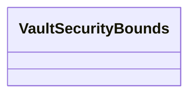
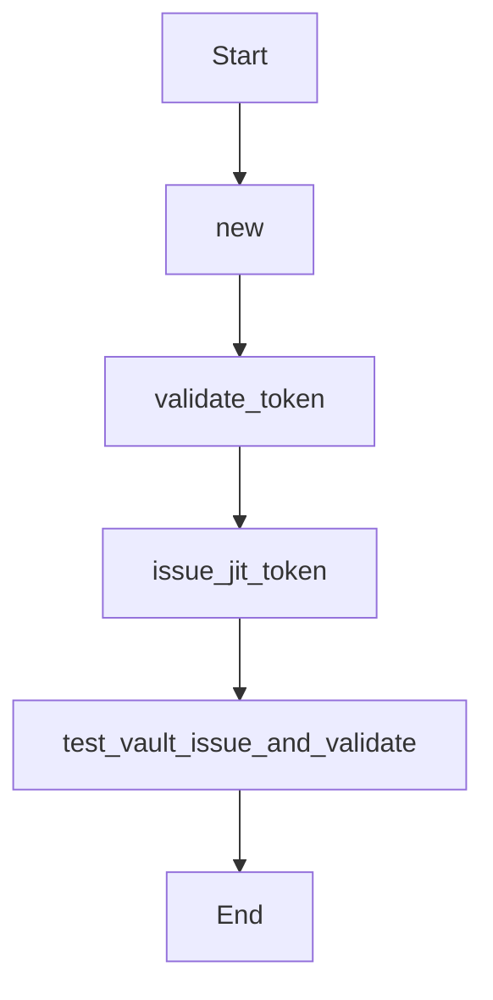

# vault.rs

Source File: `crates/factory-infrastructure/src/vault.rs`

## Component Architecture

```mermaid
classDiagram
    class VaultSecurityBounds
```

## Execution Flow

```mermaid
flowchart TD
    Start --> new
    new --> validate_token
    validate_token --> issue_jit_token
    issue_jit_token --> test_vault_issue_and_validate
    test_vault_issue_and_validate --> End
```
