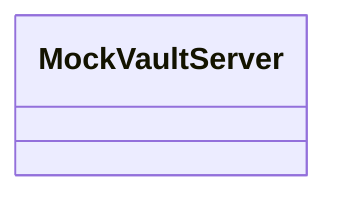
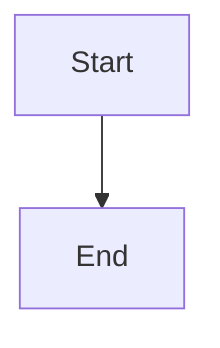

# vault_test_fixtures.rs

Source File: `crates/factory-infrastructure/src/vault_test_fixtures.rs`

## Component Architecture

```mermaid
classDiagram
    class MockVaultServer
```

## Execution Flow

```mermaid
flowchart TD
    Start --> End
```
