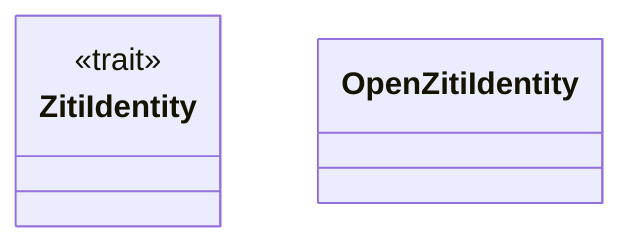
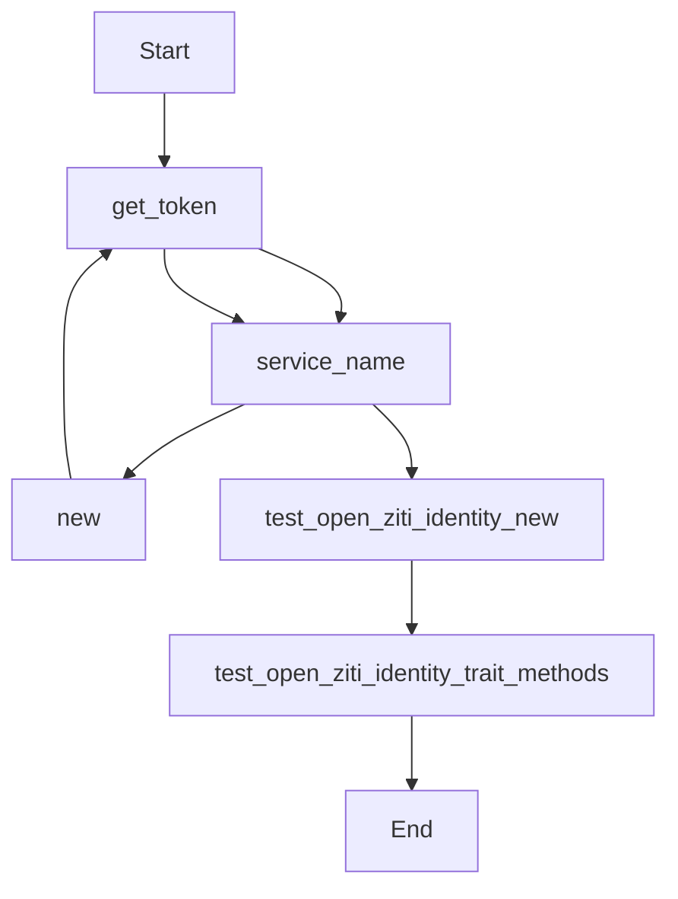

# ziti.rs

Source File: `crates/factory-infrastructure/src/ziti.rs`

## Component Architecture

```mermaid
classDiagram
    class ZitiIdentity {
        <<trait>>
    }
    class OpenZitiIdentity
```

## Execution Flow

```mermaid
flowchart TD
    Start --> get_token
    get_token --> service_name
    service_name --> new
    new --> get_token
    get_token --> service_name
    service_name --> test_open_ziti_identity_new
    test_open_ziti_identity_new --> test_open_ziti_identity_trait_methods
    test_open_ziti_identity_trait_methods --> End
```
