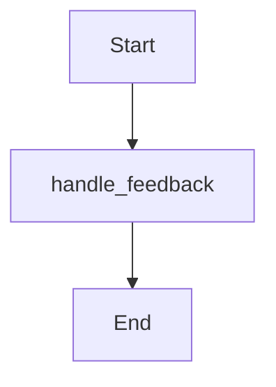

# feedback_route.rs

Source File: `crates/factory-mcp-server/src/feedback_route.rs`

## Component Architecture

```mermaid
classDiagram
    class Empty
```

## Execution Flow

```mermaid
flowchart TD
    Start --> handle_feedback
    handle_feedback --> End
```
