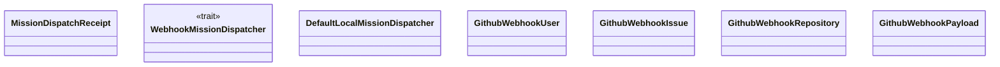
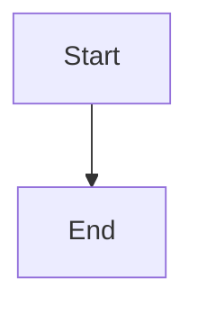

# github_webhook.rs

Source File: `crates/factory-mcp-server/src/github_webhook.rs`

## Component Architecture

```mermaid
classDiagram
    class MissionDispatchReceipt
    class WebhookMissionDispatcher {
        <<trait>>
    }
    class DefaultLocalMissionDispatcher
    class GithubWebhookUser
    class GithubWebhookIssue
    class GithubWebhookRepository
    class GithubWebhookPayload
```

## Execution Flow

```mermaid
flowchart TD
    Start --> End
```
