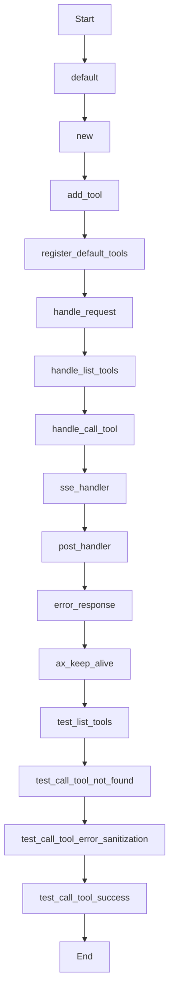

# lib.rs

Source File: `crates/factory-mcp-server/src/lib.rs`

## Component Architecture

```mermaid
classDiagram
    class McpServer
```

## Execution Flow

```mermaid
flowchart TD
    Start --> default
    default --> new
    new --> add_tool
    add_tool --> register_default_tools
    register_default_tools --> handle_request
    handle_request --> handle_list_tools
    handle_list_tools --> handle_call_tool
    handle_call_tool --> sse_handler
    sse_handler --> post_handler
    post_handler --> error_response
    error_response --> ax_keep_alive
    ax_keep_alive --> test_list_tools
    test_list_tools --> test_call_tool_not_found
    test_call_tool_not_found --> test_call_tool_error_sanitization
    test_call_tool_error_sanitization --> test_call_tool_success
    test_call_tool_success --> End
```
