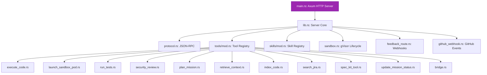

# factory-mcp-server — Crate Overview

> **Source**: `crates/factory-mcp-server/src/lib.rs`
> **Layer**: Interface (Onion Architecture — outermost presentation layer)

---

## MCP Server Architecture

## Protocol Stack

| Layer | Component | Protocol |
|:---|:---|:---|
| Transport | Axum HTTP Server | HTTP/1.1, HTTP/2 |
| Framing | JSON-RPC 2.0 | `tools/call`, `tools/list` |
| Security | OpenZiti + NHI | Ed25519 + Zero Trust |
| Execution | gVisor Sandbox | K8s Job + RuntimeClass |

---

> *Related: [Tactical Design](TACTICAL-DESIGN.md) · [tools/mod.rs](crates_factory-mcp-server_src_tools_mod.md)*
