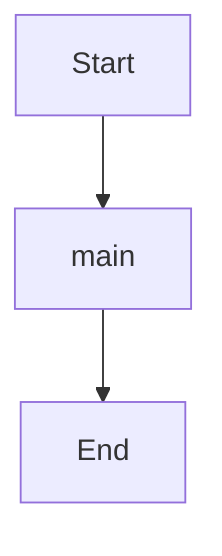

# main.rs

Source File: `crates/factory-mcp-server/src/main.rs`

## Component Architecture

```mermaid
classDiagram
    class Empty
```

## Execution Flow

```mermaid
flowchart TD
    Start --> main
    main --> End
```
