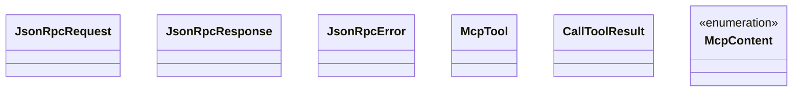
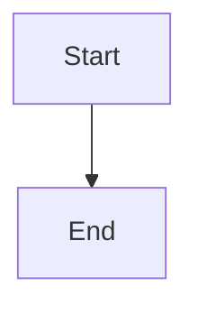

# protocol.rs

Source File: `crates/factory-mcp-server/src/protocol.rs`

## Component Architecture

```mermaid
classDiagram
    class JsonRpcRequest
    class JsonRpcResponse
    class JsonRpcError
    class McpTool
    class CallToolResult
    class McpContent {
        <<enumeration>>
    }
```

## Execution Flow

```mermaid
flowchart TD
    Start --> End
```
