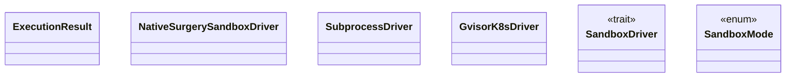
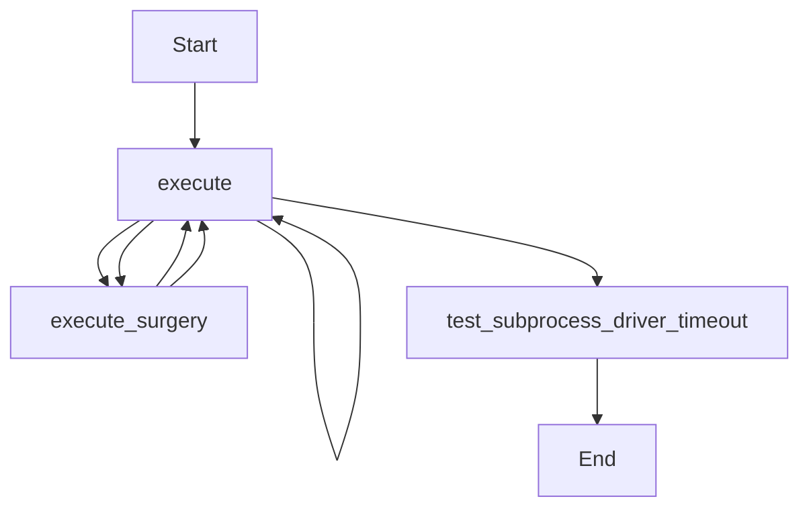

# sandbox.rs

Source File: `crates/factory-mcp-server/src/sandbox.rs`

## Component Architecture

```mermaid
classDiagram
    class ExecutionResult
    class NativeSurgerySandboxDriver
    class SubprocessDriver
    class GvisorK8sDriver
    class SandboxDriver {
        <<trait>>
    }
    class SandboxMode {
        <<enum>>
    }
```

## Execution Flow

```mermaid
flowchart TD
    Start --> execute
    execute --> execute_surgery
    execute_surgery --> execute
    execute --> execute_surgery
    execute_surgery --> execute
    execute --> execute
    execute --> test_subprocess_driver_timeout
    test_subprocess_driver_timeout --> End
```
