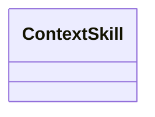
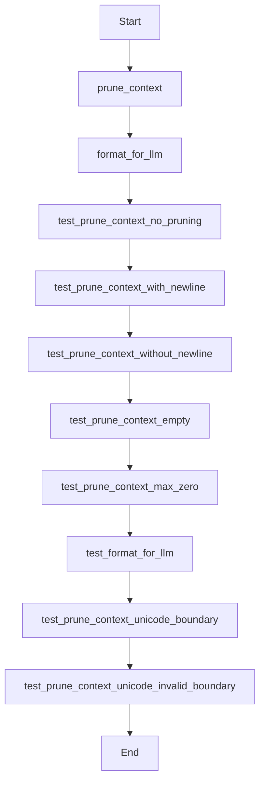

# context.rs

Source File: `crates/factory-mcp-server/src/skills/context.rs`

## Component Architecture

```mermaid
classDiagram
    class ContextSkill
```

## Execution Flow

```mermaid
flowchart TD
    Start --> prune_context
    prune_context --> format_for_llm
    format_for_llm --> test_prune_context_no_pruning
    test_prune_context_no_pruning --> test_prune_context_with_newline
    test_prune_context_with_newline --> test_prune_context_without_newline
    test_prune_context_without_newline --> test_prune_context_empty
    test_prune_context_empty --> test_prune_context_max_zero
    test_prune_context_max_zero --> test_format_for_llm
    test_format_for_llm --> test_prune_context_unicode_boundary
    test_prune_context_unicode_boundary --> test_prune_context_unicode_invalid_boundary
    test_prune_context_unicode_invalid_boundary --> End
```
