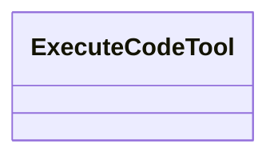
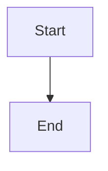

# execute_code.rs

Source File: `crates/factory-mcp-server/src/tools/execute_code.rs`

## Component Architecture

```mermaid
classDiagram
    class ExecuteCodeTool
```

## Execution Flow

```mermaid
flowchart TD
    Start --> End
```
