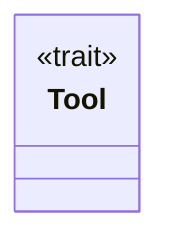

# mod.rs

Source File: `crates/factory-mcp-server/src/tools/mod.rs`

## Component Architecture



## Execution Flow

```mermaid
flowchart TD
    Start --> name
    name --> description
    description --> input_schema
    input_schema --> call
    call --> End
```
