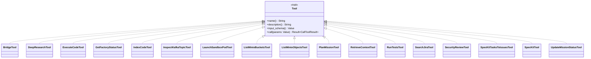

# factory-mcp-server::tools — Tool Dispatch Registry

> **Source**: `crates/factory-mcp-server/src/tools/mod.rs`  
> **Layer**: Interface  
> **Role**: Tool dispatch registry managing dynamic tool registration, JSON-RPC schema contracts, authorization checks, and request routing to concrete tool implementations.

---

## Tool Trait & Dispatch Architecture

```mermaid
classDiagram
    class Tool {
        <<trait>>
        +name() String
        +description() String
        +input_schema() Value
        +call(params: Value) Result~CallToolResult~
    }

    class BridgeTool
    class DeepResearchTool
    class ExecuteCodeTool
    class GetFactoryStatusTool
    class IndexCodeTool
    class InspectKafkaTopicTool
    class LaunchSandboxPodTool
    class ListMinioBucketsTool
    class ListMinioObjectsTool
    class PlanMissionTool
    class RetrieveContextTool
    class RunTestsTool
    class SearchJiraTool
    class SecurityReviewTool
    class SpecKitTasksToIssuesTool
    class SpecKitTool
    class UpdateMissionStatusTool

    Tool <|.. BridgeTool
    Tool <|.. DeepResearchTool
    Tool <|.. ExecuteCodeTool
    Tool <|.. GetFactoryStatusTool
    Tool <|.. IndexCodeTool
    Tool <|.. InspectKafkaTopicTool
    Tool <|.. LaunchSandboxPodTool
    Tool <|.. ListMinioBucketsTool
    Tool <|.. ListMinioObjectsTool
    Tool <|.. PlanMissionTool
    Tool <|.. RetrieveContextTool
    Tool <|.. RunTestsTool
    Tool <|.. SearchJiraTool
    Tool <|.. SecurityReviewTool
    Tool <|.. SpecKitTasksToIssuesTool
    Tool <|.. SpecKitTool
    Tool <|.. UpdateMissionStatusTool
```

## Registered MCP Tools Catalog

| Tool Name | Module | Primary Purpose | Authorized Agents |
|:---|:---|:---|:---|
| `bridge` | [`bridge.rs`](crates_factory-mcp-server_src_tools_bridge.md) | Bidirectional bridge communication | All Agents |
| `deep_research` | [`deep_research_tool.rs`](crates_factory-mcp-server_src_tools_deep_research_tool.md) | Multi-step Hatchet background research | Rustant, DocAgent |
| `execute_code` | [`execute_code.rs`](crates_factory-mcp-server_src_tools_execute_code.md) | Surgical code execution in sandbox | ZeroClaw |
| `get_factory_status` | [`get_factory_status.rs`](crates_factory-mcp-server_src_tools_get_factory_status.md) | System health and metrics inspection | All Agents |
| `index_code` | [`index_code.rs`](crates_factory-mcp-server_src_tools_index_code.md) | AST parsing and vector indexing | ZeroClaw, DocAgent |
| `inspect_kafka_topic` | [`inspect_kafka_topic.rs`](crates_factory-mcp-server_src_tools_inspect_kafka_topic.md) | Live Kafka topic diagnostics | QAObserver, Auditor |
| `launch_sandbox_pod` | [`launch_sandbox_pod.rs`](crates_factory-mcp-server_src_tools_launch_sandbox_pod.md) | Provision gVisor/K8s sandbox container | ZeroClaw |
| `list_minio_buckets` | [`list_minio_buckets.rs`](crates_factory-mcp-server_src_tools_list_minio_buckets.md) | Storage bucket discovery | All Agents |
| `list_minio_objects` | [`list_minio_objects.rs`](crates_factory-mcp-server_src_tools_list_minio_objects.md) | S3 artifact object listing | All Agents |
| `plan_mission` | [`plan_mission.rs`](crates_factory-mcp-server_src_tools_plan_mission.md) | Decomposes mission requirements into DAG | Rustant |
| `retrieve_context` | [`retrieve_context.rs`](crates_factory-mcp-server_src_tools_retrieve_context.md) | R2R hybrid semantic context retrieval | All Agents |
| `run_tests` | [`run_tests.rs`](crates_factory-mcp-server_src_tools_run_tests.md) | Automated test execution in sandbox | QAObserver, ZeroClaw |
| `search_jira` | [`search_jira.rs`](crates_factory-mcp-server_src_tools_search_jira.md) | Enterprise Jira issue queries | Rustant |
| `security_review` | [`security_review.rs`](crates_factory-mcp-server_src_tools_security_review.md) | Static SAST & secret analysis | Auditor |
| `spec_kit_tasks_to_issues` | [`spec_kit_tasks_to_issues.rs`](crates_factory-mcp-server_src_tools_spec_kit_tasks_to_issues.md) | Converts tasks.md into GitHub issues | Rustant |
| `spec_kit_tool` | [`spec_kit_tool.rs`](crates_factory-mcp-server_src_tools_spec_kit_tool.md) | Spec-driven code intelligence | Rustant, ZeroClaw |
| `update_mission_status` | [`update_mission_status.rs`](crates_factory-mcp-server_src_tools_update_mission_status.md) | State transitions in DAG | All Agents |

---

> *Related: [lib.rs](crates_factory-mcp-server_src_lib.md) · [Tactical Design](TACTICAL-DESIGN.md)*
