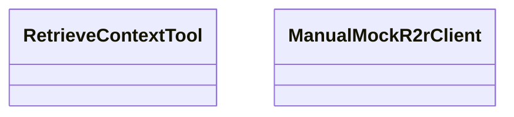

# retrieve_context.rs

Source File: `crates/factory-mcp-server/src/tools/retrieve_context.rs`

## Component Architecture



## Execution Flow

```mermaid
flowchart TD
    Start --> new
    new --> name
    name --> description
    description --> input_schema
    input_schema --> call
    call --> search
    search --> push_osr_metric
    push_osr_metric --> test_retrieve_context_tool_success
    test_retrieve_context_tool_success --> test_retrieve_context_tool_failure
    test_retrieve_context_tool_failure --> End
```
