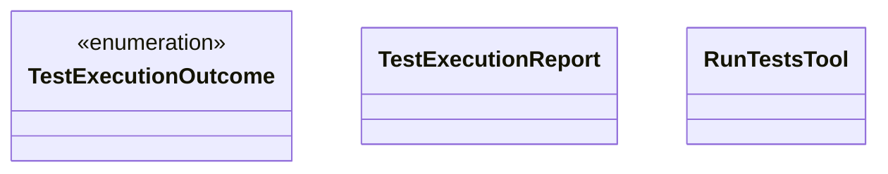
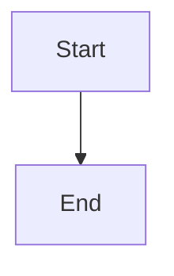

# run_tests.rs

Source File: `crates/factory-mcp-server/src/tools/run_tests.rs`

## Component Architecture

```mermaid
classDiagram
    class TestExecutionOutcome {
        <<enumeration>>
    }
    class TestExecutionReport
    class RunTestsTool
```

## Execution Flow

```mermaid
flowchart TD
    Start --> End
```
