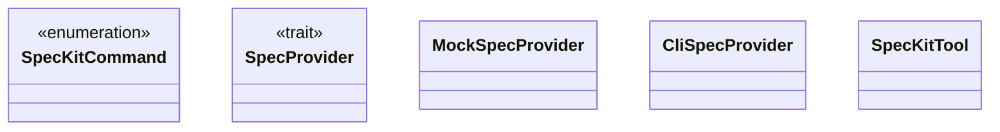

# spec_kit_tool.rs

Source File: `crates/factory-mcp-server/src/tools/spec_kit_tool.rs`

## Component Architecture



## Execution Flow

```mermaid
flowchart TD
    Start --> invoke
    invoke --> new
    new --> default
    default --> invoke
    invoke --> new
    new --> invoke
    invoke --> new
    new --> with_provider
    with_provider --> invoke_spec_kit
    invoke_spec_kit --> name
    name --> description
    description --> input_schema
    input_schema --> call
    call --> test_mock_spec_provider
    test_mock_spec_provider --> test_cli_spec_provider_fallback
    test_cli_spec_provider_fallback --> test_spec_kit_tool_mock_mode
    test_spec_kit_tool_mock_mode --> End
```
