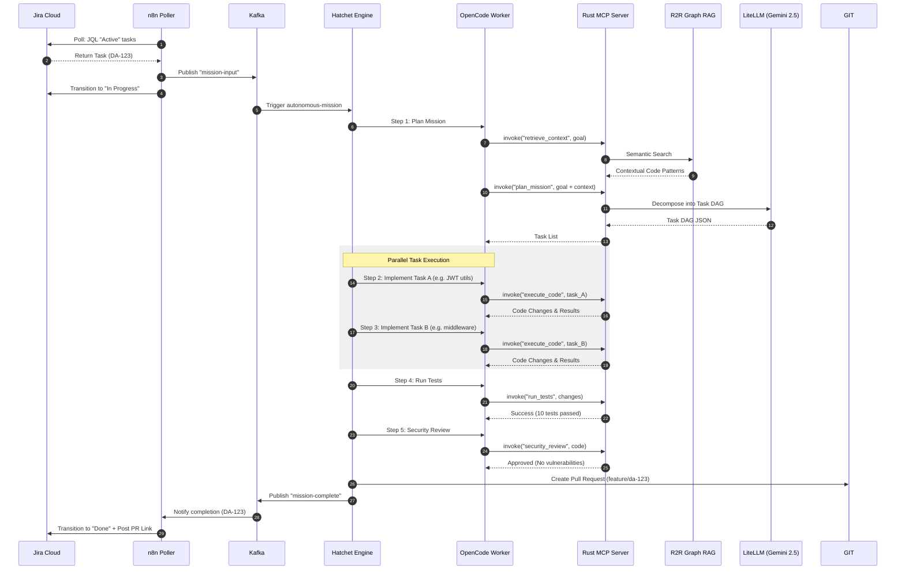
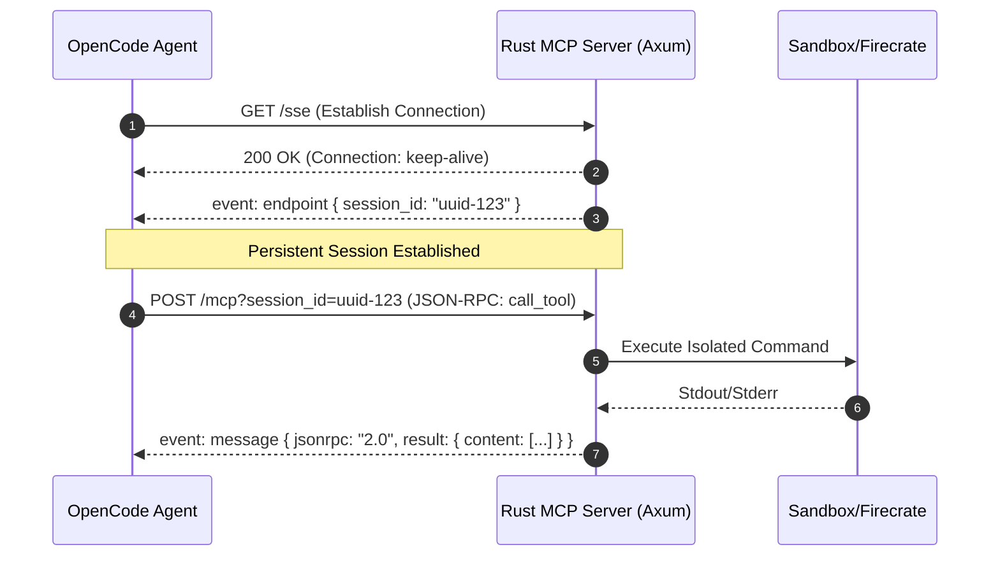
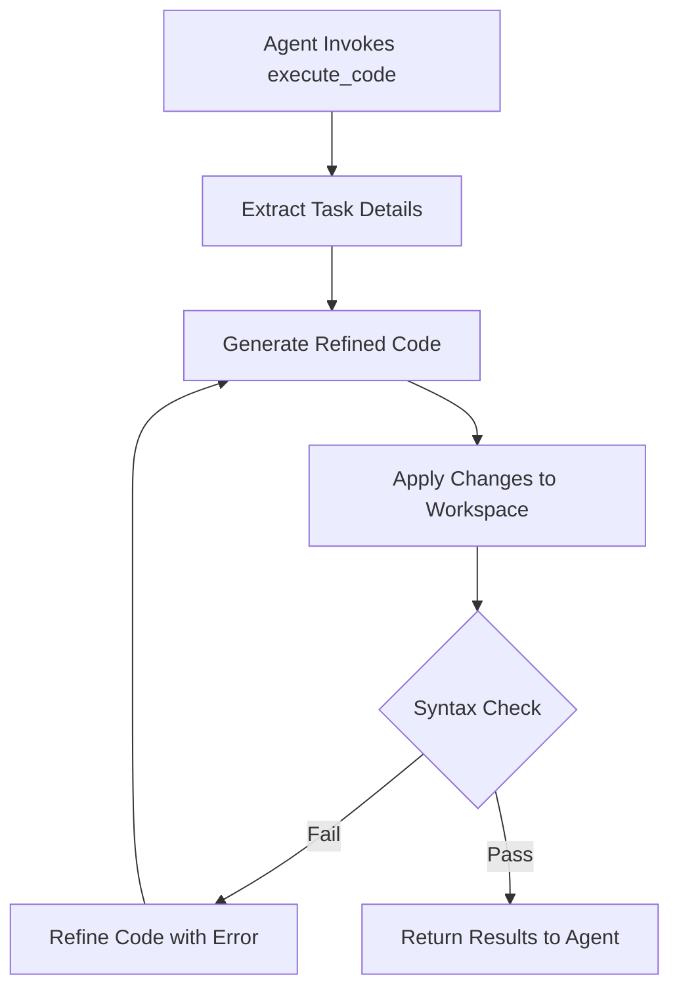
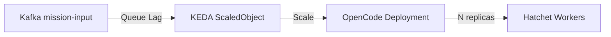

# 🔄 Execution Flows: Dark Gravity CA/CD

## 🗺️ Mission End-to-End Sequence Diagram

This diagram visualizes a full cycle, from the initial Jira ticket to the final PR submission.

---

## 🌩️ SSE Transport Flow (Unified Communication)

The factory uses a persistent **SSE (Server-Sent Events)** stream for bidirectional tool execution. This ensures long-running tasks (like code generation or test suites) do not timeout and provide real-time feedback.

---

## 🛠️ Tool Execution Internal Flow

The `ExecuteCodeTool` is the most active tool in the system. It handles code generation, refinement, and initial validation.

---

## 🏗️ Verification Loop

No code reaches the `main` branch without surviving the **Verification Triad**:

1. **Logical Verification**:
    - **Coder Agent**: Implements the logic.
    - **Tester Agent**: Verifies that the logic works.
2. **Architectural Verification**:
    - **Reviewer Agent**: Checks for design patterns and system alignment.
3. **Security Verification**:
    - **SecurityReviewTool**: Automated scanning of code for SQL injections, hardcoded secrets, and unsafe dependencies.

---

## 🌩️ KEDA Autoscaling

The factory scales horizontally based on mission demand (Kafka lag).

> [!NOTE]
> This ensures zero idling resource overhead while maintaining high throughput for large bursts of missions.
