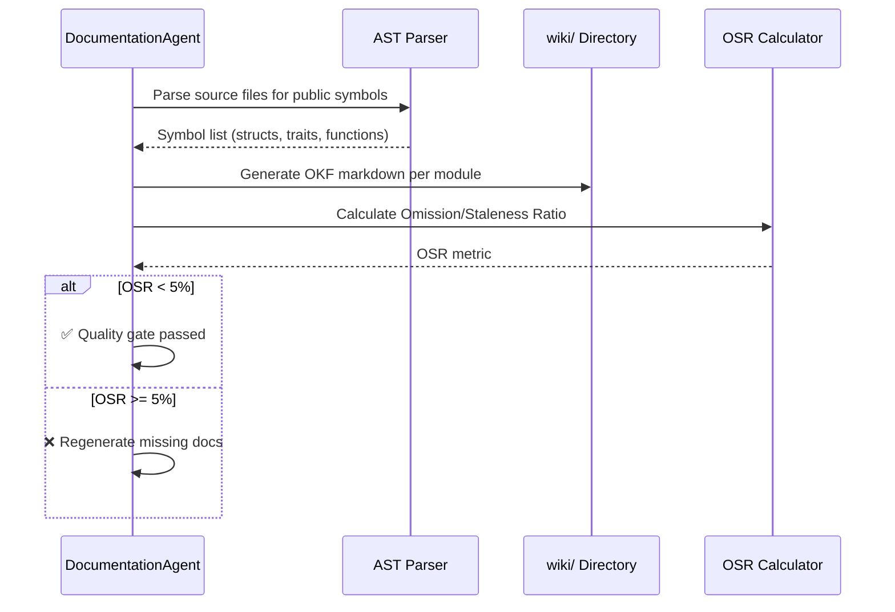

# factory-application::agents::doc_agent — DocumentationAgent

> **Source**: `crates/factory-application/src/agents/doc_agent.rs`
> **Layer**: Application

---

## Wiki Generation Flow

## OSR (Omission/Staleness Ratio) Calculation

| Metric | Formula | Gate |
|:---|:---|:---|
| Missing Symbols | `undocumented_public_symbols / total_public_symbols` | < 5% |
| Stale Pages | `pages_not_updated_since_last_code_change / total_pages` | < 5% |
| Combined OSR | `max(missing, stale)` | < 5% |

---

> *Related: [OSR Calculator](../utils/osr.md) · [HITL Governance](../../../security/hitl_governance.md)*
