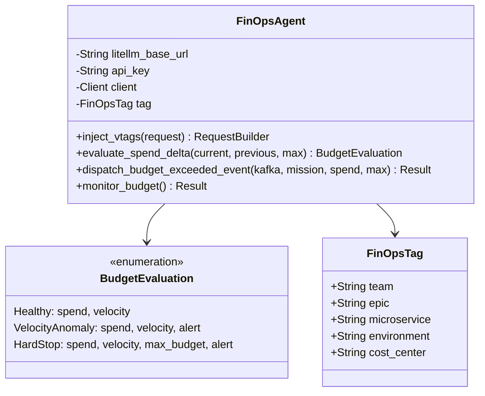
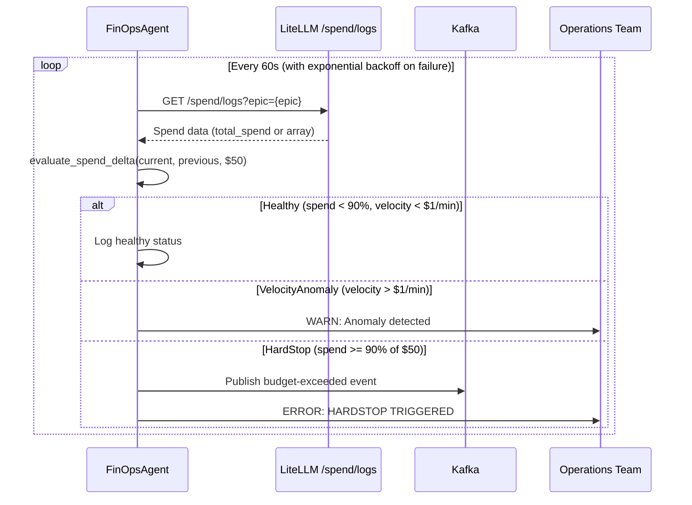

# factory-application::agents::finops — FinOpsAgent

> **Source**: `crates/factory-application/src/agents/finops.rs`
> **Layer**: Application

---

## UML Class Diagram

## Budget Enforcement Sequence

## Circuit Breaker Backoff

| Consecutive Failures | Behavior | Interval |
|:---|:---|:---|
| 0 | Normal polling | 60s |
| 1-4 | ERROR log + exponential backoff | 120s → 240s → 480s |
| 5+ | WARN log (downgraded) | Capped at 900s |

---

> *Related: [AuditorAgent](auditor.md) · [Compliance & Audit](../../../security/compliance_audit.md)*
