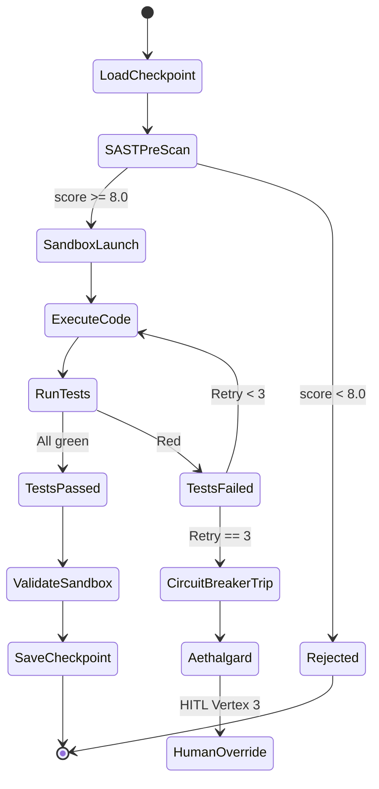
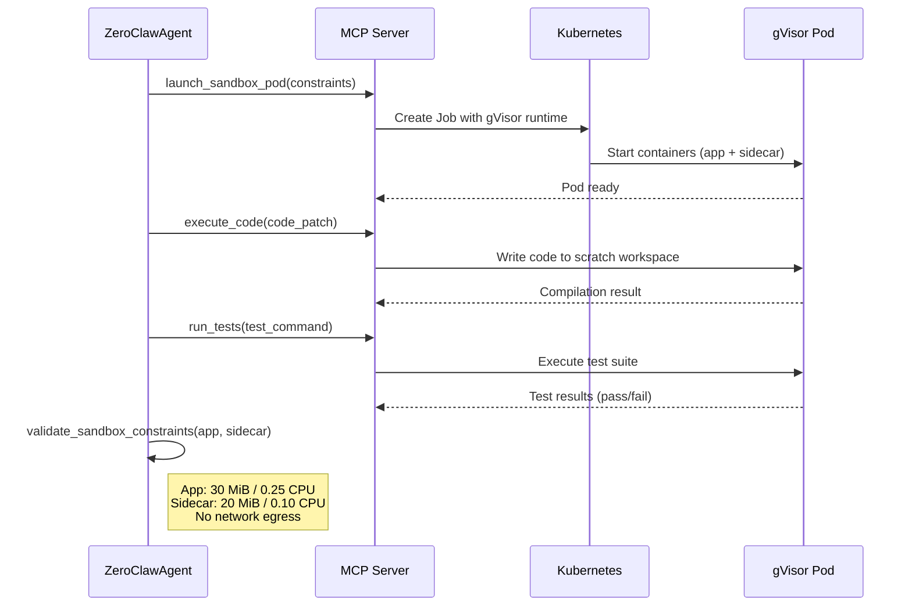

# factory-application::agents::zeroclaw — ZeroClawAgent (Developer)

> **Source**: `crates/factory-application/src/agents/zeroclaw.rs`
> **Layer**: Application

---

## TDD Loop State Machine

## Sandbox Execution Sequence

## Tool Authorization

| Tool | Authorized |
|:---|:---:|
| `launch_sandbox_pod` | ✅ |
| `execute_code` | ✅ |
| `run_tests` | ✅ |
| `security_review` | ✅ |
| `sync_bridge_state` | ✅ |
| `introspect_k8s` | ✅ |
| `plan_mission` | ❌ |
| `retrieve_context` | ❌ |

---

> *Related: [RustantAgent](rustant.md) · [AuditorAgent](auditor.md)*
