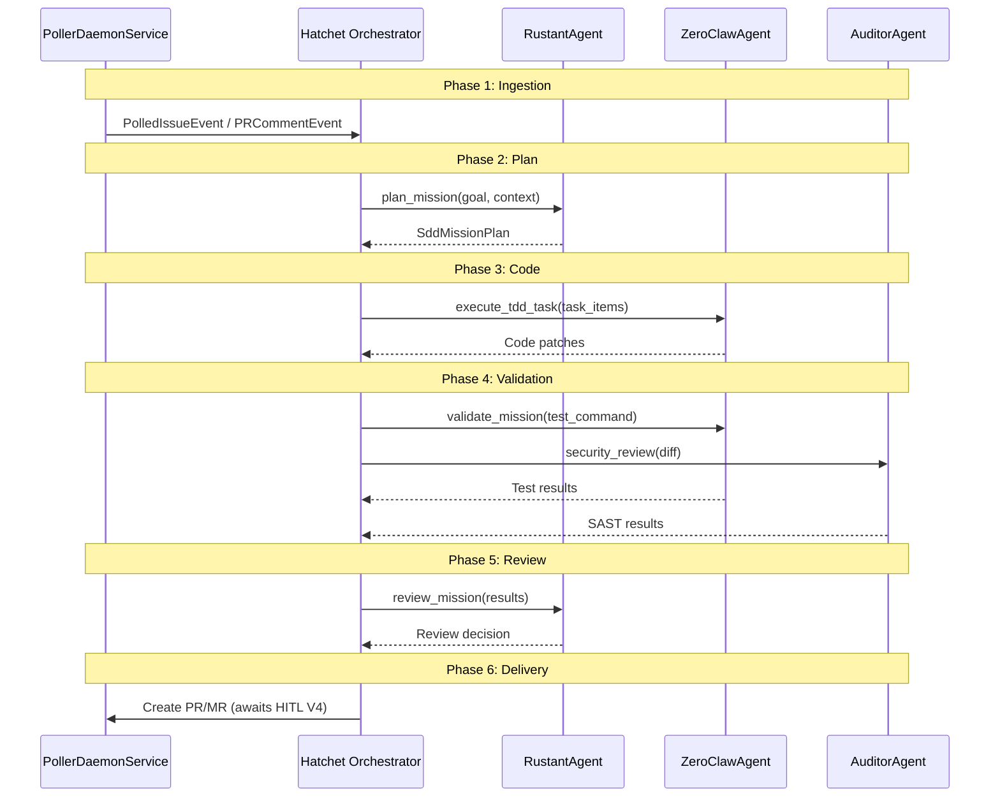

# factory-application::workflows::autonomous_mission — 6-Phase Hatchet DAG

> **Source**: `crates/factory-application/src/workflows/autonomous_mission.rs`
> **Layer**: Application

---

## 6-Phase DAG Sequence Diagram

---

> *Related: [circuit_breaker.rs](circuit_breaker.md) · [Experiment Lifecycle](../../../architecture/runtime_sequences.md)*
