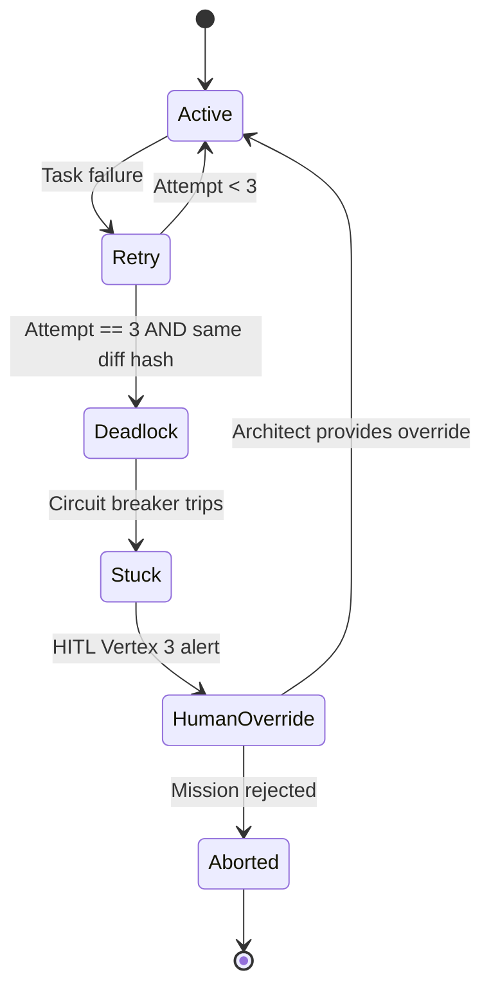

# factory-application::workflows::circuit_breaker — Aethelgard

> **Source**: `crates/factory-application/src/workflows/circuit_breaker.rs`
> **Layer**: Application

---

## Aethelgard State Machine

## Deadlock Detection

| Condition | Threshold | Action |
|:---|:---|:---|
| Consecutive failures | 3 attempts | Check diff hash |
| Diff hash unchanged | Same hash across 3 attempts | Trip circuit breaker |
| Diff hash changed | Different hash | Reset counter, allow retry |

---

> *Related: [develop_task.rs](develop_task.md) · [HITL Governance](../../../security/hitl_governance.md)*
