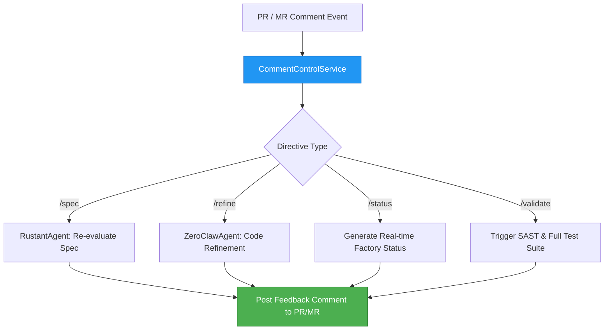

# factory-application::workflows::comment_control — PR/MR Interactive Comment Control

> **Source**: `crates/factory-application/src/workflows/comment_control.rs`  
> **Layer**: Application  
> **Role**: Parses `@darkgravity` and `@dark-gravity` interactive directives from GitHub PR comments and GitLab MR notes to drive live autonomous interaction.

---

## Interactive Directives Dispatch Flow

## Supported Directives

| Directive | Handler Agent | Action |
|:---|:---|:---|
| `@darkgravity /spec <feedback>` | `RustantAgent` | Re-evaluates specification requirements and updates `spec.md`. |
| `@darkgravity /refine <instruction>` | `ZeroClawAgent` | Executes code surgery in isolated sandbox according to feedback. |
| `@darkgravity /status` | Service | Replies with real-time DAG state, execution metrics, and sandbox logs. |
| `@darkgravity /validate` | Service | Launches SAST security audit and automated verification tests. |

---

> *Related: [HITL Governance](../../../security/hitl_governance.md) · [User Manual](../../../operations/user_manual.md)*
