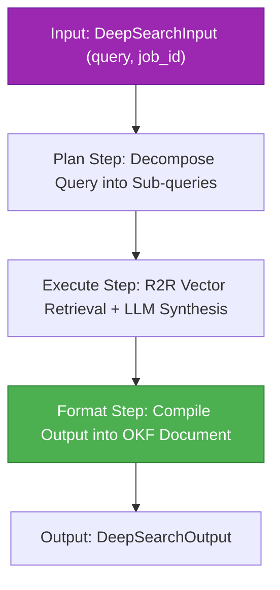

# factory-application::workflows::deep_research — Deep Research Orchestration

> **Source**: `crates/factory-application/src/workflows/deep_research.rs`  
> **Layer**: Application  
> **Role**: Hatchet-orchestrated multi-step deep knowledge research combining LiteLLM query decomposition and R2R vector retrieval.

---

## Deep Research Hatchet Workflow

## Security & FinOps Controls

- **FinOps Tags**: Inserts `litellm-tags` headers (`{"epic": "DeepSearch", "task": "ResearchDAG"}`) on all requests to LiteLLM for exact per-query cost attribution.
- **Memory Zeroization**: Implements `Zeroize` on temporary buffers holding sensitive query embeddings or retrieved contexts.

---

> *Related: [r2r.rs](../../infrastructure/r2r.md) · [trigger_deep_search.rs](../../cli/trigger_deep_search.md)*
