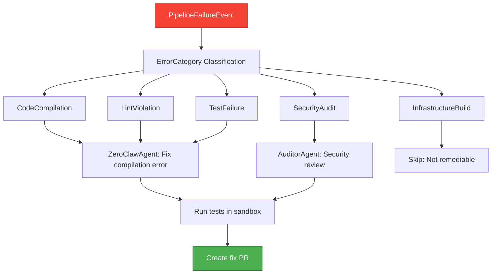

# factory-application::workflows::pipeline_remediation — CI/CD Auto-Fix

> **Source**: `crates/factory-application/src/workflows/pipeline_remediation.rs`
> **Layer**: Application

---

## CI/CD Pipeline Auto-Remediation Flow

---

> *Related: [autonomous_mission.rs](autonomous_mission.md)*
