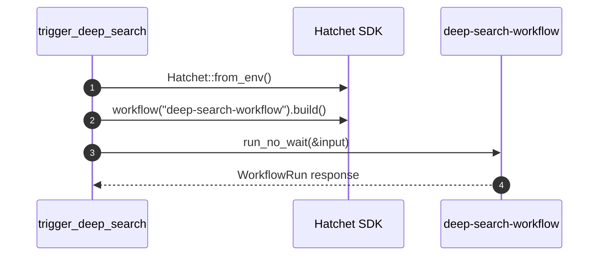

# factory-cli::bin::trigger_deep_search — Deep Search CLI Trigger

> **Source**: `crates/factory-cli/src/bin/trigger_deep_search.rs`  
> **Layer**: Interface  
> **Role**: Standalone CLI binary to trigger asynchronous deep research workflows via Hatchet SDK.

---

## Execution Flow



## CLI Usage

```bash
cargo run --bin trigger_deep_search -- --query "Research OpenZiti zero trust architectures in Rust applications"
```

---

> *Related: [deep_research.rs](../application/workflows/deep_research.md) · [Tactical Design](../../architecture/tactical_design.md)*
