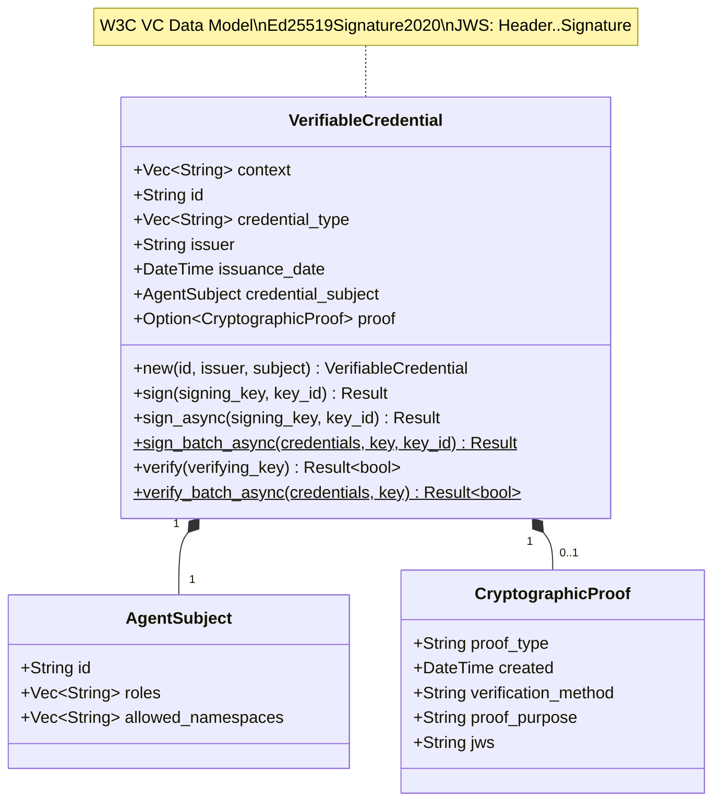
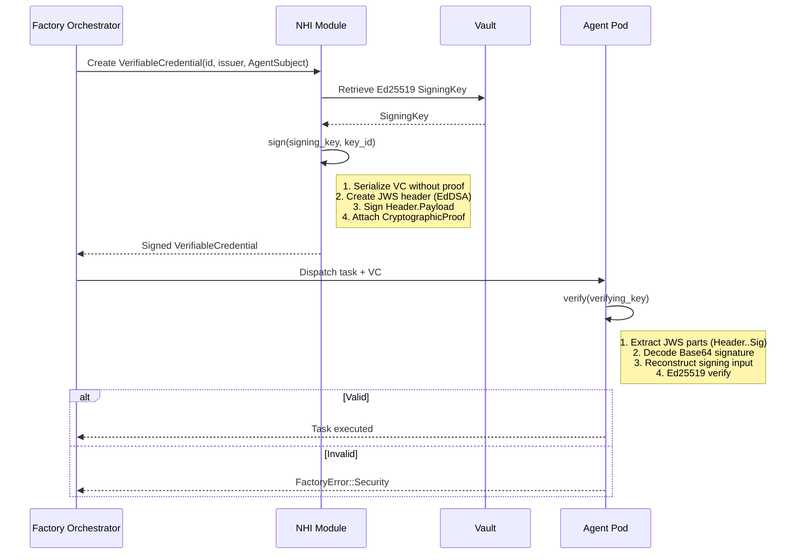

# factory-core::security::nhi — Non-Human Identity Credentials

> **Source**: `crates/factory-core/src/security/nhi.rs`
> **Layer**: Domain

---

## UML Class Diagram

## NHI Credential Issuance and Verification Sequence

## Batch Operations

| Method | Description | Concurrency |
|:---|:---|:---|
| `sign_batch_async` | Signs multiple VCs concurrently | `tokio::task::spawn_blocking` per VC |
| `verify_batch_async` | Verifies multiple VCs concurrently | Returns `false` on first failure |

---

> *Related: [security.rs](security.md) · [Security Architecture](../../security/security_architecture.md)*
